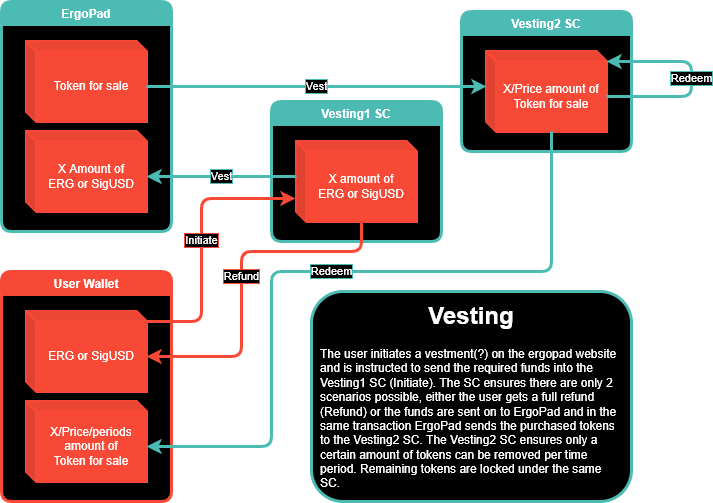
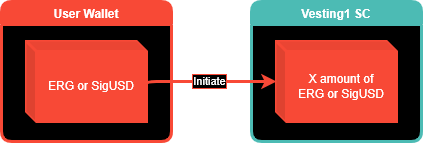
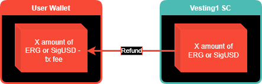
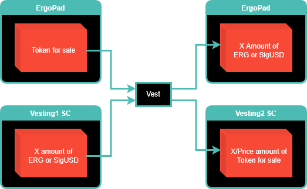
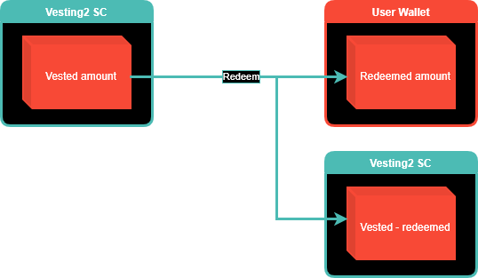

# ErgoPad Vesting Setup

Tokens purchased during presales will often be vested according to a schedule such that they are released to the open market over a longer period of time to avoid affecting the price too much.
To enable this ErgoPad has built the following setup enabling tokens to be locked with any vesting period.

## Contracts/Box types

These contracts are in play in the vesting setups

### vesting1

This contract ensures that the seller gets the correct amount of currency (fe. Erg or SigUSD) and the buyer gets the correct amount of tokens locked in the actual vesting contract (See vesting2)
If there is anything not matching the buyer can get a refund minus transaction fees.
Important characteristics:
- Seller
  - Type of currency used
  - Amount of currency
- Buyer
  - The output box is guarded with the vesting2 contract
  - The vesting parameters are in order (start date, period length, redeemable tokens per period etc.)
  - The vesting parameter ensuring the tokens are redeemed to the buyers address
  - The amount of tokens vested

### vesting2

This is the actual contract that handles the vesting itself. It will ensure a vesting box is recreated with the same parameters as long as there are remaining redeemable tokens. It also ensures the tokens can only be redeemed to the address that initially vested them. Because the contract ensures this anyone can perform the redeeming transaction, as long as the tokens end up in the right wallet.
For efficiency purposes the index of the output boxes is not hardcoded. That allows batching redeem operations and save the network from processing hundreds of transactions everytime a period has ended.
Important characteristics:
- A new vesting box is created with the remaining tokens and identical parameters, unless the last remaining tokens are redeemed
- The buyer gets the correct amount of tokens redeemed
Registers:

| Register | Type | Description |
| --- | --- | --- |
| 4 | Coll\[Byte\] | ErgoTree of the buyers address |
| 5 | Long | Redeem period length in ms |
| 6 | Long | Amount of tokens to be redeemed each period |
| 7 | Long | Timestamp of the start of the vestment (ms since epoch) |
| 8 | Long | Total amount of tokens vested initially |

## Transactions

The interaction between the different contracts and the user happens through the following transactions

### Initiate

The initiate transaction is the transaction which is used to lock the buyers funds into a vesting1 box. This can be achieved using either the assembler or a dapp connector.

### Refund

In case of error funds send to the vesting1 box/contract can be refunded back to the buyer.

### Vest

A vest transaction will be executed when all the conditions are met to send funds to the seller and vest the corresponding tokens for the buyer.

### Redeem

The redeem transaction sends the amount of tokens that are freed up according to the vesting schedule towards the wallet of the buyer.

